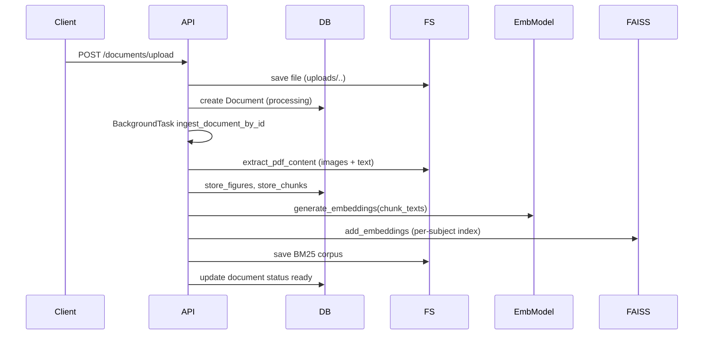

CHAPTER 3
PRESENT WORK CARRIED OUT

3.1 System Overview

FlowDocs AI is implemented as a two-tier web application: a FastAPI backend that exposes REST and WebSocket APIs, and a Vite + React frontend that provides an interactive knowledge-operating UI. The backend implements document ingestion, chunking, embedding, vector indexing (FAISS), BM25 sparse retrieval, hybrid RAG pipelines, LLM provider abstractions (Ollama / OpenAI / Gemini), chat orchestration, workspace & membership management, notifications, and presence tracking. The frontend implements authentication, workspace & subject selection, document upload, chat interfaces, direct messaging (DM), workspace chat, streaming LLM responses, and realtime updates via WebSockets.

Key entry points and implementation artifacts:
- Backend application startup: [backend/main.py](backend/main.py)
- WebSocket connection manager: [backend/app/websocket/connection_manager.py](backend/app/websocket/connection_manager.py)
- Document ingestion orchestration: [backend/app/services/document_ingestion_service.py](backend/app/services/document_ingestion_service.py)
- Embeddings and FAISS services: [backend/app/embeddings/embedding_service.py](backend/app/embeddings/embedding_service.py), [backend/app/vectorstore/faiss_service.py](backend/app/vectorstore/faiss_service.py)
- RAG & retrieval: [backend/app/rag/retriever.py](backend/app/rag/retriever.py), [backend/app/rag/reranker.py](backend/app/rag/reranker.py)
- Chat orchestration and pipelines: [backend/app/chat/orchestrator.py](backend/app/chat/orchestrator.py), [backend/app/chat/pipelines/rag_pipeline.py](backend/app/chat/pipelines/rag_pipeline.py)
- Frontend entry and API client: [frontend/src/main.tsx](frontend/src/main.tsx), [frontend/src/lib/api.ts](frontend/src/lib/api.ts)
- Frontend state: [frontend/src/store/app-store.ts](frontend/src/store/app-store.ts)

3.2 Overall System Architecture

The system separates concerns across these logical layers:
- Presentation: React (Vite) single-page application (SPA) under `frontend/src/`.
- API / Orchestration: FastAPI application (`backend/main.py`) registering route modules from `app.api.routes`.
- Services & Domain Logic: `app.services.*` implements ingestion, chat, workspace operations, figure handling, notifications.
- Data Persistence: SQLAlchemy models in `app.models.*` persisted via the `app.core.database` session.
- Retrieval / Indexing: FAISS indices stored on disk (subject-scoped) using `app.vectorstore` modules; BM25 corpora persisted as pickle files per subject.
- AI Abstraction: LLM providers under `app.llm.providers` with a factory in `app.llm.factory`.

Mermaid: high-level components and data flows

```mermaid
flowchart TD
  Frontend[Frontend (Vite + React)] -->|REST / WebSocket| BackendAPI[FastAPI Backend]
  BackendAPI --> DB[(Postgres / SQLAlchemy)]
  BackendAPI -->|store images / uploads| UploadsFS[(Uploads/ images/ files)]
  BackendAPI -->|store vectors| VectorStore[(FAISS indices on disk)]
  BackendAPI -->|call| LLMs[(Ollama / OpenAI / Gemini Providers)]
  BackendAPI -->|embeddings| EmbeddingModel[SentenceTransformers]
  BackendAPI -->|BM25 corpus| BM25Files[(pickle BM25 files)]
  Frontend -->|WebSocket| BackendAPI
```

3.3 Frontend Design

3.3.1 Next.js Architecture

Note: The project uses Vite + React (not Next.js). The frontend is a client-side SPA implemented with Vite; primary files are [frontend/src/main.tsx](frontend/src/main.tsx) and [frontend/src/App.tsx](frontend/src/App.tsx). Routing is handled via `routes` components under `frontend/src/routes`.

3.3.2 UI Components

Major components and responsibilities (files):
- `AppShell` ([frontend/src/components/AppShell.tsx](frontend/src/components/AppShell.tsx)) — main application shell that composes the sidebar and content panes.
- `AuthScreen` ([frontend/src/components/AuthScreen.tsx](frontend/src/components/AuthScreen.tsx)) — authentication UI.
- Chat UI: `ChatPanel` ([frontend/src/components/ChatPanel.tsx](frontend/src/components/ChatPanel.tsx)), `MessageBubble` ([frontend/src/components/MessageBubble.tsx](frontend/src/components/MessageBubble.tsx)), `DMMessageBubble` ([frontend/src/components/DMMessageBubble.tsx](frontend/src/components/DMMessageBubble.tsx)) implement message rendering and streaming updates.
- Document & Figures: `DocumentsPanel` ([frontend/src/components/DocumentsPanel.tsx](frontend/src/components/DocumentsPanel.tsx)), `FigurePreview` ([frontend/src/components/figures/FigurePreview.tsx](frontend/src/components/figures/FigurePreview.tsx)), `CitationPanel` ([frontend/src/components/CitationPanel.tsx](frontend/src/components/CitationPanel.tsx)).
- Layout: `Sidebar` ([frontend/src/components/layout/Sidebar.tsx](frontend/src/components/layout/Sidebar.tsx)).

UI primitives (small controls) are under `frontend/src/components/ui/*` (buttons, inputs, avatar, badge, skeleton). These are standard small components used by panels.

3.3.3 State Management

Client state uses `zustand` with persistence middleware: [frontend/src/store/app-store.ts](frontend/src/store/app-store.ts). The store centralizes:
- Authentication token and user profile
- Selected workspace/subject/conversation
- Workspaces, subjects, documents, conversations, messages
- Provider and prompt mode preferences
- Streaming state for in-progress LLM responses

The API client (`frontend/src/lib/api.ts`) uses a small `request` wrapper to inject Bearer tokens and handle errors. The application relies on the store for token management and to persist the minimal session state to local storage.

3.3.4 API Integration

Frontend uses `frontend/src/lib/api.ts` to call backend endpoints. Key interactions include:
- Authentication: POST `/auth/register`, `/auth/login` ([backend/app/api/routes/auth.py](backend/app/api/routes/auth.py))
- Workspace/subject/document management: `/workspaces/`, `/subjects/`, `/documents/` ([backend routes under `app.api.routes`])
- Document upload uses an XHR upload to `/documents/upload/{subject_id}` and supports progress reporting in the UI.
- Chat: POST `/chat/` and streaming endpoints (chat streaming implemented server-side) — the client triggers chat and expects synchronous JSON or streaming via `chat_stream` routes.
- WebSocket connections for DMs, workspace chat, and notifications: client uses `frontend/src/lib/websocket.ts` to connect to `/ws/dm/{id}`, `/ws/workspaces/{id}`, and `/ws/notifications`.

3.4 Backend Design

3.4.1 FastAPI Architecture

The backend is a modular FastAPI application: route modules are registered in [backend/main.py](backend/main.py). Routes are organized by resource under `backend/app/api/routes/` — e.g., `auth.py`, `document.py`, `chat.py`, `chat_stream.py`, `websockets.py`, `workspace_members.py`, `workspace.py`, `subject.py`, `research.py`, `dm.py`.

Dependency injection is used for authentication and DB session access (see `app.api.dependencies.auth.get_current_user`, `get_current_user_ws`, and `app.core.database.get_db`).

3.4.2 Route Organization

- Authentication: [backend/app/api/routes/auth.py](backend/app/api/routes/auth.py) — register & login endpoints.
- Documents: [backend/app/api/routes/document.py](backend/app/api/routes/document.py) — upload and listing per subject. Upload triggers ingestion in background via FastAPI BackgroundTasks.
- Chat & RAG: `chat.py`, `chat_stream.py` endpoints which call chat orchestrator and batching. `chat_stream` likely exposes a streaming endpoint using provider.stream.
- WebSockets: [backend/app/api/routes/websockets.py](backend/app/api/routes/websockets.py) — DM, workspace chat, notifications. Connections validated with `get_current_user_ws` WebSocket dependency.

3.4.3 Service Layer

The `app.services` package contains domain logic: conversation management, chat streaming, notifications, workspace access, user services, ingestion, figure processing, indexing, and presence. Notable files:
- `document_ingestion_service.py` orchestrates PDF extraction, section detection, chunking, filtering, DB storage, embedding generation, FAISS addition, BM25 updates, figure indexing. (See [backend/app/services/document_ingestion_service.py](backend/app/services/document_ingestion_service.py)).
- `chat_service.py` and `chat_stream_service.py` implement chat orchestration and streaming interactions (server-side orchestration uses LLM providers).
- `workspace_chat_service.py`, `dm_service.py`, `workspace_member_service.py` manage collaborative and messaging features.

3.4.4 Repository Layer

The repository layer is thin in this codebase: SQLAlchemy is used directly in services and route handlers (`db.query`, `db.add`, `db.commit`). There is an `app.repositories` package placeholder, but most data operations are implemented in service files and route code referencing models in `app.models`.

3.5 Database Design

3.5.1 Entity Relationship Structure

SQLAlchemy models in `backend/app/models` define the schema. Core entities and relationships:
- `User` ([backend/app/models/user.py](backend/app/models/user.py)) — owns workspaces, participates in DMs, has research_profile and workspace memberships.
- `Workspace` ([backend/app/models/workspace.py](backend/app/models/workspace.py)) — owned by a `User`, contains `Subject` entities and `WorkspaceMember` relations.
- `Subject` (model file exists under `app.models.subject`) — groups documents; subjects belong to a workspace.
- `Document` ([backend/app/models/document.py](backend/app/models/document.py)) — belongs to a `Subject`; has many `Chunk` and `Figure` records.
- `Chunk` ([backend/app/models/chunk.py](backend/app/models/chunk.py)) — stores chunked text slices for retrieval and indexing.
- `Figure` ([backend/app/models/figure.py](backend/app/models/figure.py)) — stores image path, caption, page, and nearby text.
- `Conversation`, `Message` — workspace conversations and messages.
- `DMConversation`, `DMMessage`, `DMParticipant` — direct messaging tables.
- `WorkspaceMember` and `WorkspaceInvitation` — membership and invitation flows.

3.5.2 Core Tables

- `users` — id, username, email, hashed_password, is_active
- `workspaces` — id, name, user_id(owner)
- `subjects` — id, name, workspace_id
- `documents` — file metadata, file_path, subject_id, processing_status
- `chunks` — chunk text, index, document_id, section metadata
- `figures` — image_path, caption, page, dimensions
- `conversations`, `messages`, `dm_conversations`, `dm_messages` — messaging tables

3.5.3 Relationships

- One-to-many: Workspace -> Subjects, Subject -> Documents, Document -> Chunks, Document -> Figures
- Many-to-many (via `WorkspaceMember` entity semantics): Users <-> Workspaces
- Conversations reference workspace and subject and have messages (one-to-many)

3.6 Authentication and Authorization

3.6.1 JWT Authentication

Authentication uses OAuth2 password flow endpoints and JWT access tokens. Core modules:
- Token creation and verification: [backend/app/core/security.py](backend/app/core/security.py) — uses `python-jose` to encode/decode JWTs with a secret from env vars and expiry controlled by `ACCESS_TOKEN_EXPIRE_MINUTES`.
- Login endpoint issues tokens in `auth.py` (see `/auth/login`).
- Dependency `get_current_user` decodes JWT and loads `User` from DB: [backend/app/api/dependencies/auth.py](backend/app/api/dependencies/auth.py)
- WebSocket authentication: `get_current_user_ws` reads a `token` query parameter on the WS URL and verifies it with `decode_access_token` (used by WebSocket routes in `websockets.py`).

3.6.2 Password Security

Passwords are hashed using `passlib` with `bcrypt` (see `pwd_context` in `app.core.security`); `hash_password` and `verify_password` are used in registration and login flows.

3.6.3 Role-Based Access Control

Role checks are implemented at the workspace level in `app.services.workspace_access_service`. Roles supported: `viewer`, `editor`, `owner`. Authorization helpers:
- `verify_workspace_access` validates membership or owner status (raises HTTP 403 when denied).
- `verify_workspace_role` enforces minimum role levels using an integer `ROLE_HIERARCHY` map.

3.7 Document Processing Pipeline

3.7.1 Document Upload

Upload flow is implemented in `backend/app/api/routes/document.py`:
- Endpoint: POST `/documents/upload/{subject_id}` accepts a file field via multipart form.
- File saving: uploaded files are saved under `uploads/{subject_id}/{uuid}.{ext}`; file metadata stored in `documents` table with `processing_status` initialised to "processing".
- Background ingestion: `ingest_document_by_id` is queued with FastAPI `BackgroundTasks` to process the file asynchronously.

3.7.2 Text Extraction

PDF extraction is implemented using PyMuPDF (`fitz`) in `backend/app/ingestion/pdf_extractor.py`:
- Page text extraction is layout-aware: page.get_text("dict") is used to extract lines, fontsizes, and detect bold text for heading heuristics.
- Table of contents (TOC) is extracted via `document.get_toc()` and used to build section boundaries.
- Figures/images are extracted from page images and saved to `uploads/images/{document_id}/...`.

3.7.3 Figure Extraction

Figure detection is done during PDF extraction by scanning images and text for figure captions. Extracted images include metadata: `page_number`, `figure_index`, `image_filename`, `image_path`, `width`, `height`, and `nearby_text`. These are stored to DB via `app.services.figure_service.store_figures`, which also calls `app.vision.caption_service.generate_caption` to add a textual caption for each figure.

3.7.4 Chunking Strategy

Chunking uses the `langchain_text_splitters.RecursiveCharacterTextSplitter` configured with:
- chunk_size=800 and chunk_overlap=150
- separators: ["\n\n","\n",". "," ",""]

Section detection merges TOC-driven boundaries and layout/regex heading heuristics (`section_detector.py`). After sections are formed, `chunk_sections` (in `ingestion/chunker.py`) produces chunks that include metadata: `chunk_index`, `text`, `section_title`, `parent_section`, `hierarchy_level`, `start_page`, `end_page`.

3.7.5 Metadata Generation

Chunks and figures retain metadata such as section titles, parent sections, hierarchy level, start/end pages, and nearby text for figures. These are persisted in `chunks` and `figures` tables, and preserved for citation generation during RAG.

3.8 Retrieval-Augmented Generation Pipeline

3.8.1 Embedding Generation

Embeddings are generated with `sentence_transformers.SentenceTransformer` in `backend/app/embeddings/embedding_service.py`. The model name is driven by the `EMBEDDING_MODEL` environment variable (default "BAAI/bge-base-en-v1.5"). The API provides `generate_embedding` for single strings and `generate_embeddings` for batch encoding.

3.8.2 Subject-Isolated Indexing

Vector stores are subject-scoped (per workspace_id and subject_id) and persisted on disk under `vector_storage/{workspace_id}/{subject_id}/index.faiss` with accompanying `chunk_ids.pkl`. The module `backend/app/vectorstore/faiss_service.py` implements functions to create/load/save indices, add embeddings, and search indices.

3.8.3 Hybrid Retrieval

Hybrid retrieval merges dense FAISS-based similarity search with sparse BM25 retrieval:
- Dense retrieval: `faiss_service.search_index` returns top-k chunk ids and scores after computing a query embedding.
- Sparse retrieval: BM25 index is cached via `app.rag.bm25_cache` and searched for top-k documents.
- Results are merged (dense-first, then sparse), and hybrid scores computed in `app.rag.retriever.retrieve_chunks` combining rank-based inverses.

3.8.4 Reranking

An optional cross-encoder reranker based on `sentence_transformers.CrossEncoder` is available in `app.rag.reranker.Reranker`. If `use_reranker` is enabled, the pipeline calls `reranker.rerank` to order candidate chunks by cross-encoder scores.

3.8.5 Prompt Construction

Prompt strategies are implemented under `app.prompting.strategies.*` and chosen via `app.prompting.factory.get_prompt_strategy(mode)`. Strategies build task-specific prompts by formatting chunk context and figure context and applying mode-specific instruction templates (e.g., `TeachingStrategy`, `ResearcherStrategy`, `DefaultStrategy`). Example: `DefaultStrategy.build` composes numbered context blocks and figure summaries into a final prompt text used by LLM providers.

3.9 AI Integration Layer

3.9.1 OpenAI Integration

OpenAI provider is implemented in `backend/app/llm/providers/openai_provider.py`. It uses the `openai` Python client (instance `OpenAI`) to call the Chat Completions API. It implements `generate` (synchronous) and `stream` (generator for streamed responses).

3.9.2 Ollama Integration

Ollama provider (`backend/app/llm/providers/ollama_provider.py`) calls `ollama.chat` with `stream=True` option to support streaming tokens. Default model name is `llama3` but determined by the provider initialization.

3.9.3 Provider Abstraction

A `BaseLLMProvider` abstract base class in `app.llm.providers.base` defines `generate` and `stream` interfaces. `app.llm.factory.get_llm_provider(provider)` returns a provider instance by name (`openai`, `gemini`, otherwise `ollama`). This isolates the rest of the code from provider-specific SDKs.

3.10 Collaboration and Communication Module

3.10.1 Workspace Architecture

Workspaces are first-class units represented by `Workspace` model and accessible via membership rules enforced in `workspace_access_service`. Workspaces contain subjects and support workspace chat; messages are stored in `WorkspaceMessage` model and broadcast to online members via WebSockets.

3.10.2 Direct Messaging

DMs are implemented with `DMConversation`, `DMParticipant`, and `DMMessage` models. WebSocket endpoint `/ws/dm/{conversation_id}` accepts connections behind `get_current_user_ws` authentication and uses `app.services.dm_service.send_dm_message` to persist messages. Notifications are created for participants other than the sender.

3.10.3 WebSocket Communication

Server-side WebSocket routes in `backend/app/api/routes/websockets.py` handle three namespaces:
- `/ws/dm/{conversation_id}` — direct messaging channel validated with `verify_dm_access`.
- `/ws/workspaces/{workspace_id}` — workspace chat channel validated with `verify_workspace_access`.
- `/ws/notifications` — per-user notification channel.

The `ConnectionManager` implemented at [backend/app/websocket/connection_manager.py](backend/app/websocket/connection_manager.py) manages per-room sets of `WebSocket` objects and provides broadcast helpers: `broadcast_conversation`, `broadcast_workspace`, and `broadcast_notification`.

3.10.4 Research Discovery

Research profiles are embedded and indexed separately in `app.vectorstore.research_faiss` (single global index) and `app.research.profile_embedding` builds profile embeddings. The discovery endpoint in `app.api.routes.research` queries this vector to find researchers similar to a query.

3.11 Frontend–Backend Interaction Flow

- Authentication: UI sends credentials to `/auth/login` and stores token in `useAppStore`.
- Workspace/Subject selection: client fetches `/workspaces` and `/subjects` and sets selected workspace/subject in the store.
- Document upload: client uploads file to `/documents/upload/{subject_id}` and receives a `Document` record. Ingestion runs in background; UI polls document list via `/documents/subject/{subject_id}`.
- Chat: user composes a query and calls `/chat/` (or `/chat/stream`). Backend performs retrieval and LLM generation, returning answer + citations.
- Realtime: client opens WebSocket connections using token query param for DM, workspace, and notifications. Incoming events update the UI store and generate notifications.

3.12 Sequence of Operations

Document Upload Flow (pseudocode):

- Client POST /documents/upload/{subject_id} with multipart file
- Server stores file to `uploads/{subject_id}/{uuid}` and creates `Document` row (processing_status="processing")
- Server queues `ingest_document_by_id(document_id, workspace_id, subject_id)` as background task
- Background ingestion executes: extract_pdf_content -> store_figures -> build_sections -> chunk_sections -> filter_chunks -> store_chunks -> generate_embeddings -> add_embeddings (FAISS) -> save_bm25_corpus -> index_figure_captions -> index_figure_images -> update document.processing_status to "ready"

Retrieval Flow (pseudocode from `app.rag.retriever`):

- receive query, workspace_id, subject_id
- compute query_embedding via `embedding_service.generate_embedding`
- dense_results = `faiss_service.search_index`
- bm25_results = `bm25_cache.get_index(...).search(query)`
- merged_ids = order preserving merge of dense then sparse
- load chunk records for merged_ids from DB
- compute hybrid_score combining rank-based dense and sparse ranks
- optionally rerank with cross-encoder
- return top-k chunks

Chat Flow (pseudocode from `RAGPipeline.run`):

- chunks = retrieve_chunks(...)
- figures = retrieve_figures(...)
- strategy = get_prompt_strategy(mode)
- prompt = strategy.build(query, chunks, figures)
- llm = get_llm_provider(provider)
- answer = llm.generate(prompt)
- citations = build_citation_block(chunks)
- return {answer, citations, sources: chunks, figures}

Collaboration Flow (DM / Workspace Chat + Notifications):

- client opens WS with `?token=<jwt>` and room path
- server authenticates via `get_current_user_ws`
- on message received, server persists message and sends broadcast via `ConnectionManager.broadcast_*`
- server also creates notifications for recipients via `notification_service.create_notification`

3.13 Key Design Decisions and Justifications

- Hybrid retrieval (dense + sparse) balances semantic recall with exact-match recall; implemented in `app.rag.retriever` to improve retrieval completeness.
- Subject-scoped FAISS indices (one index per workspace+subject) reduce index size and make retrieval context-specific, implemented by `faiss_service.get_subject_directory`.
- Background ingestion decouples upload latency from heavy processing (PDF extraction, embedding), implemented via FastAPI `BackgroundTasks` in document upload route.
- Provider abstraction (`BaseLLMProvider`) isolates SDK differences and allows fallback between Ollama, OpenAI, and Gemini without changing higher-level pipelines.
- Streaming support: LLM providers expose streaming generators (`provider.stream`) and chat stream endpoints wire up provider streaming to clients.

3.14 Challenges Encountered and Solutions

Observed choices in code that address practical challenges:
- PDF layout variance: `section_detector.py` uses a hybrid TOC + layout + regex approach to robustly detect sections across differing PDFs.
- Large file indexing: FAISS indices and BM25 corpora are stored on disk per subject and cached in memory (`_index_cache`) in `faiss_service` to avoid reloading on every request.
- Websocket auth: WebSocket connections authenticate via token query parameter with `get_current_user_ws` to support browser WS connections that cannot send Authorization headers as easily.

Feature Status (explicit)
- Implemented features:
  - User registration & JWT authentication (`app.api.routes.auth`, `app.core.security`)
  - Workspace and subject management (routes + models)
  - Document upload, PDF extraction, section detection, chunking, filtering (full pipeline in `app.ingestion` + `document_ingestion_service`)
  - Embedding generation (`app.embeddings.embedding_service`) and FAISS indexing/search (`app.vectorstore.*`)
  - BM25 sparse retrieval and hybrid merging (`app.rag.*`, `bm25_cache`)
  - Cross-encoder reranker (`app.rag.reranker`)
  - Prompt strategies (`app.prompting.strategies`) and LLM provider adapters (`app.llm.providers`)
  - Chat orchestration (RAG/general) and workspace chat + DMs over WebSocket
  - Figure extraction and captioning hook (`app.vision.caption_service`) with caption+image indexing

- Partially implemented / needs validation:
  - Gemini provider placeholder `app.llm.providers.gemini_provider.py` exists but requires credentials and testing.
  - Some `app.repositories` package appears as a placeholder; data access is implemented directly in services rather than a decoupled repository layer.
  - UI routing and some components (e.g., comparison views) are present in frontend but may not be fully wired depending on backend endpoints.

- Planned / TODO features (observed from TODOs & code patterns):
  - More advanced multi-modal retrieval (image–text fusion) beyond separate caption/image indices.
  - Permission granularity and audit logs beyond current role hierarchy.
  - Scalable vector storage (move from on-disk FAISS to remote vector DB for multi-instance deployments).

Appendices

Implementation Summary Table

- See table below for a concise mapping of implemented modules and their primary files.

Technology Usage Table

- Backend: Python, FastAPI, SQLAlchemy, PyMuPDF (fitz), faiss, sentence-transformers, passlib, python-jose
- Frontend: React, Vite, TypeScript, Zustand

Feature Completion Matrix

- Auth: Implemented
- Document ingestion: Implemented
- Embeddings & FAISS: Implemented (on-disk)
- BM25 & hybrid retrieval: Implemented
- Reranker: Implemented
- LLM providers: Ollama & OpenAI implemented; Gemini present as provider skeleton
- Streaming chat: Implemented (provider streaming wrappers + chat_stream endpoints)
- WebSocket real-time: Implemented for DMs, workspace chat, notifications

Mermaid: retrieval & ingestion sequence




---

If you want, I can expand any subsection with more detailed tables of function-level responsibilities and include line-numbered references to the precise functions (e.g., cite specific method implementations). I can also run a quick grep to produce a full manifest of all source files and ensure no file was missed in this analysis.
